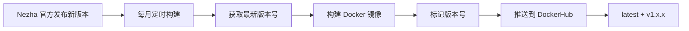

# 版本同步说明

本项目的 Docker 镜像版本会自动与 Nezha Agent 官方版本同步。

## 🔄 版本同步机制

### 自动同步

GitHub Actions 在构建镜像时会自动：

1. **获取最新版本号**
   ```bash
   curl -sL https://api.github.com/repos/nezhahq/agent/releases/latest | jq -r '.tag_name'
   ```

2. **下载对应版本**
   - Dockerfile 会下载与标签对应的 Nezha Agent 版本

3. **标记镜像版本**
   - 镜像标签使用 Nezha Agent 的版本号（如 `v1.14.1`）
   - 同时保留 `latest` 标签指向最新版本

## 📋 镜像标签策略

### 主要标签

| 标签                    | 说明                                       | 示例              |
| ----------------------- | ------------------------------------------ | ----------------- |
| `latest`                | 始终指向最新版本                           | `latest`          |
| `v{major}.{minor}.{patch}` | Nezha Agent 版本号                       | `v1.14.1`         |
| `{YYYYMMDD}`            | 构建日期                                   | `20250125`        |

### 使用建议

**生产环境推荐：**
```yaml
# 使用具体版本号，便于版本控制和回滚
image: whoerau/nezha-agent-v2:v1.14.1
```

**测试环境推荐：**
```yaml
# 使用 latest 标签，始终获取最新版本
image: whoerau/nezha-agent-v2:latest
```

## 🔍 查看版本信息

### 查看镜像包含的 Nezha Agent 版本

```bash
# 运行容器并查看版本
docker run --rm whoerau/nezha-agent-v2:latest /opt/nezha/agent/nezha-agent --version

# 或查看镜像标签
docker pull whoerau/nezha-agent-v2:latest
docker images whoerau/nezha-agent-v2
```

### 在 DockerHub 查看所有版本

访问：https://hub.docker.com/r/whoerau/nezha-agent-v2/tags

## 📅 版本发布周期

### 定期构建

- **时间**：每月 1 号凌晨 2:00（UTC）
- **目的**：确保镜像使用最新的 Nezha Agent 版本

### 触发构建

以下情况会触发新版本构建：

1. **官方新版本发布**（每月定时检查）
2. **Dockerfile 更新**（推送到 main 分支）
3. **手动触发**（在 GitHub Actions 页面）

## 🔄 版本更新流程



## 🛠️ 手动触发新版本构建

如果 Nezha Agent 发布了新版本，而你想立即构建，可以：

### 方法 1：GitHub Actions 手动触发

1. 访问仓库的 Actions 页面
2. 选择 "Build and Push Docker Image"
3. 点击 "Run workflow"
4. 选择 main 分支
5. 点击 "Run workflow" 确认

### 方法 2：推送 Dockerfile 变更

```bash
# 修改 Dockerfile 触发构建（即使是空提交）
git commit --allow-empty -m "chore: trigger rebuild for new nezha-agent version"
git push origin main
```

## 📦 版本固定 vs 自动更新

### Docker 镜像版本固定

**优势：**
- ✅ 版本可控，便于回滚
- ✅ 环境一致性好
- ✅ 适合生产环境

**使用方式：**
```yaml
image: whoerau/nezha-agent-v2:v1.14.1
environment:
  - NZ_DISABLE_AUTO_UPDATE=true  # 禁用 Agent 自动更新
```

### Agent 自动更新（推荐）

**优势：**
- ✅ 始终使用最新特性
- ✅ 自动获得安全更新
- ✅ 无需手动干预

**使用方式：**
```yaml
image: whoerau/nezha-agent-v2:latest
environment:
  - NZ_DISABLE_AUTO_UPDATE=false  # 允许 Agent 自动更新
```

## 🔐 版本验证

### 构建时验证

GitHub Actions 会在构建摘要中显示：

```markdown
### 🎉 Docker 镜像构建成功！

**镜像标签:**
- whoerau/nezha-agent-v2:latest
- whoerau/nezha-agent-v2:v1.14.1
- whoerau/nezha-agent-v2:20250125

**拉取命令:**
docker pull whoerau/nezha-agent-v2:latest
```

### 运行时验证

```bash
# 查看容器内 Agent 版本
docker-compose exec nezha-agent /opt/nezha/agent/nezha-agent --version

# 查看配置文件
docker-compose exec nezha-agent cat /app/config.yml
```

## 🆘 问题排查

### 版本不匹配

如果发现镜像版本与 Agent 版本不一致：

1. **检查构建日志**
   - GitHub Actions 构建日志会显示下载的版本号

2. **验证下载源**
   - 确认 GitHub API 可访问
   - 检查是否有网络限制

3. **手动触发重新构建**
   - 使用 GitHub Actions 手动触发功能

### API 限制

GitHub API 有速率限制，如果频繁构建可能遇到限制：

**解决方案：**
- 使用 GitHub Token 认证（在 workflow 中配置）
- 减少构建频率
- 使用缓存机制

## 📚 相关资源

- [Nezha Agent Releases](https://github.com/nezhahq/agent/releases)
- [Docker 多阶段构建](https://docs.docker.com/build/building/multi-stage/)
- [GitHub Actions 文档](https://docs.github.com/en/actions)
- [DockerHub 自动构建](https://docs.docker.com/docker-hub/builds/)

